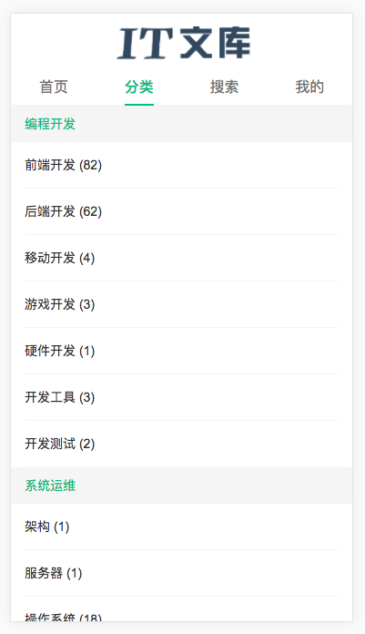
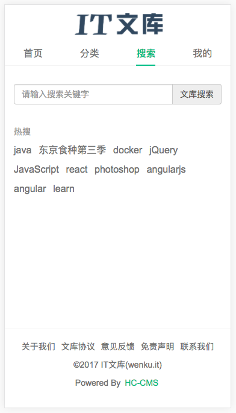
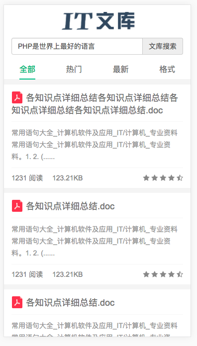
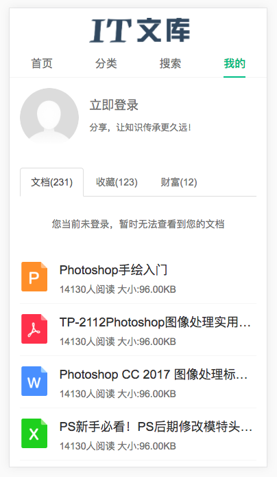
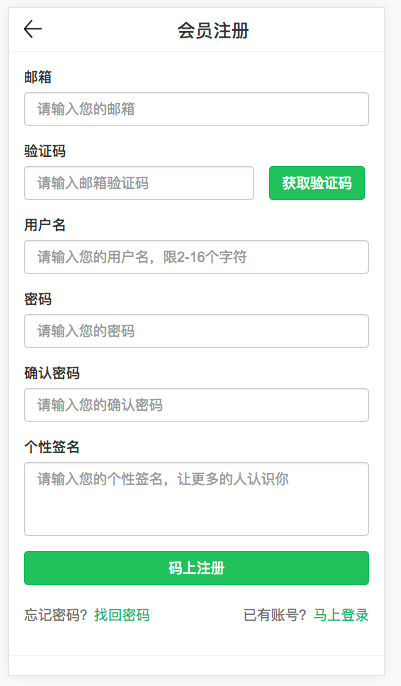
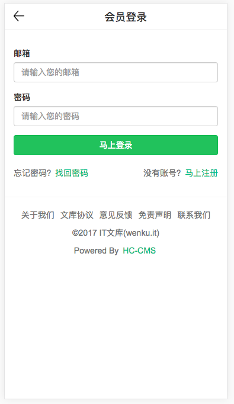
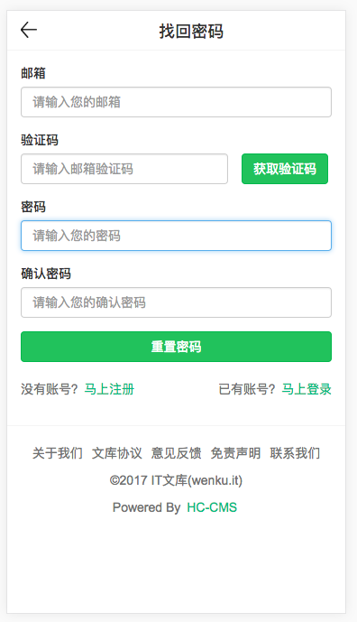
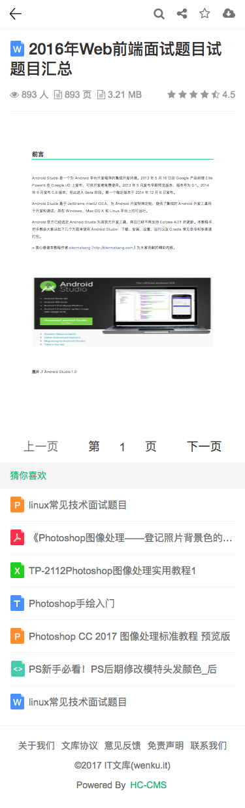

# DocHub文库移动端模板

[DocHub](https://gitee.com/TruthHun/DocHub)文库移动端模板，使用Bootstrap开发，原型主要参考百度文库移动端和新浪爱问文库移动端站点，在2017年10月份之前开发设计出来的。

但是后来由于时间原因，[DocHub](https://gitee.com/TruthHun/DocHub)文库移动端站点一直没开发。

现以Apache 2.0 开源协议，将模板开源出来，有需要的朋友可以直接拿来使用。

预览地址：http://www.hc-cms.com/H5/dochub

手机扫码预览：

## 模板托管地址
- GitHub：https://github.com/TruthHun/DocHubTemplate4Mobile
- Gitee：https://gitee.com/TruthHun/DocHubTemplate4Mobile

## DocHub文库程序源码地址
- GitHub：https://github.com/TruthHun/DocHub
- Gitee： https://gitee.com/TruthHun/DocHub

## 模板页面一览

> 首页

-----

> 分类

-----

> 搜索

-----

> 搜索结果

-----

> 用户主页

-----

> 注册

-----

> 登录

-----

> 找回密码

-----

> 文档阅读

-----

